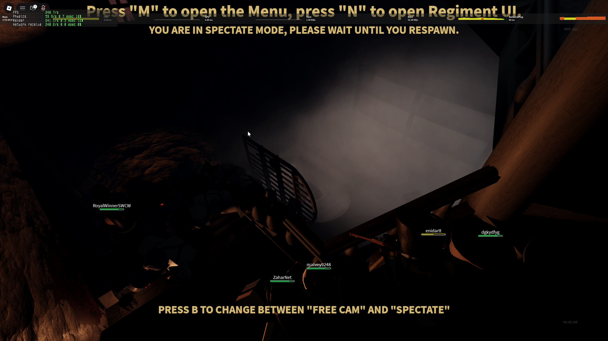

# Разблокировка Roblox на территории РФ на роутере Keenetic

[](https://github.com/Tera4Byte/roblox-vpn-keenetic/stargazers)
[](https://github.com/Tera4Byte/roblox-vpn-keenetic/network/members)
[](https://github.com/Tera4Byte/roblox-vpn-keenetic/issues)

Инструкция по разблокировке сайта и лаунчера Roblox на уровне роутера Keenetic с использованием VPN-туннеля.

---

## Содержание

- [Требования](#требования)
- [Этап 1. Добавление IP-адресов](#этап-1-добавление-ip-адресов)
- [Этап 2. Перезагрузка роутера](#этап-2-перезагрузка-роутера)
- [Этап 3. Проверка работоспособности](#этап-3-проверка-работоспособности)
- [Устранение неполадок](#устранение-неполадок)
- [Ограничения](#ограничения)
- [Источники IP-адресов](#источники-ip-адресов)
- [Контрибьюторы](#контрибьюторы)

---

## Требования

| Компонент | Описание |
|-----------|----------|
| **Роутер** | Keenetic любой модели с актуальной прошивкой KeeneticOS |
| **VPN-конфиг** | Рабочий конфигурационный файл VPN (WireGuard/AmneziaWG) |
| **Доступ** | Админ-панель роутера (`192.168.1.1` или `my.keenetic.net`) |

> [!IMPORTANT]
> На роутере должен быть настроен рабочий VPN с сервером **за пределами РФ**!  
> Инструкция по настройке: [AmneziaWG для KeeneticOS](https://github.com/arturbikbaev/AmneziaWG-for-KeeneticOS-RU)

> [!WARNING]
> VPN-сервер должен находиться за границей (Германия, Нидерланды, Финляндия и т.д.).  
> Если VPN-сервер в России — Roblox всё равно будет заблокирован!

---

## Этап 1. Добавление IP-адресов

### 1.1. Скачайте файл

Скачайте [`roblox-ip-list.txt`](roblox-ip-list.txt) из этого репозитория.

### 1.2. Откройте меню роутера

Откройте меню роутера (если свёрнуто):


### 1.3. Перейдите в раздел маршрутизации

Перейдите: **Сетевые правила** → **Маршрутизация**


### 1.4. Загрузите список IP-адресов

1. Нажмите кнопку **«Загрузить из файла»**
2. В списке **«Интерфейс»** выберите ваш VPN *(например, amnezia_PL)*
3. Нажмите на иконку загрузки файла
4. Выберите скачанный файл `roblox-ip-list.txt`
5. Нажмите **«Загрузить»**


---

## Этап 2. Перезагрузка роутера

После внесения изменений необходимо перезагрузить роутер:

1. Перейдите в **Параметры системы**

   

2. Прокрутите страницу вниз до раздела **«Перезагрузка системы»**

3. Нажмите **«Перезагрузить»**

   

4. Подтвердите перезагрузку

   

5. Дождитесь перезагрузки (1-2 минуты)

   

6. Подключитесь к Wi-Fi сети заново

---

## Этап 3. Проверка работоспособности

### 3.1. Тестирование сайта

1. Откройте браузер и перейдите на [roblox.com](https://www.roblox.com)
2. Сайт должен открыться без ошибок
3. Попробуйте запустить любой плейс
4. Запустите Roblox Studio

**Пример успешной загрузки сайта:**




### 3.2. Проверка маршрута

Убедитесь, что трафик идёт через VPN.

**Windows:**
```cmd
tracert roblox.com
```


**Linux/macOS:**
```bash
traceroute roblox.com
```


**Ожидаемый результат:**
- Хоп 2 показывает адрес VPN-туннеля (например, `10.8.x.x`)
- В маршруте присутствуют зарубежные узлы (не российские)

---

## Устранение неполадок

### Сайт не открывается

- Проверьте статус VPN на главной странице роутера (должен быть «Подключено»)
- Убедитесь, что IP-адреса загружены в раздел маршрутизации
- Очистите DNS-кэш:
  - Windows: `ipconfig /flushdns`
  - Linux: `sudo systemctl restart NetworkManager`
  - macOS: `sudo dscacheutil -flushcache && sudo killall -HUP mDNSResponder`

### VPN подключен, но Roblox не работает

- **Проверьте локацию VPN-сервера** — он должен быть за пределами РФ
- Возможно, не хватает IP-адресов — создайте [Issue](https://github.com/Tera4Byte/roblox-vpn-keenetic/issues)
- Проверьте, что выбран правильный интерфейс VPN при загрузке

### Большой пинг в плейсах

- Попробуйте VPN-сервер ближе к Европе (Германия, Нидерланды, Польша, Финляндия)
- Проверьте скорость VPN-соединения

### Ошибка «Connection timed out»

- VPN-сервер скорее всего находится в России
- Смените VPN-сервер на зарубежный
- Возможно, не импортировались IP от AWS (см. примечание ниже)

---

## Ограничения

> [!NOTE]
> Роутеры Keenetic имеют ограничение в **1024 статических маршрута**.

---

## Источники IP-адресов

### Roblox Corporation (AS22697)
- [bgp.he.net/AS22697](https://bgp.he.net/AS22697#_prefixes)

### Amazon Web Services (игровые серверы)
- [bgp.he.net — Amazon](https://bgp.he.net/search?search%5Bsearch%5D=amazon+web+services&commit=Search)

### Дополнительные источники
- [iplist.opencck.org](https://iplist.opencck.org/ru)

### Готовый файл

Скачайте [`roblox-ip-list.txt`](roblox-ip-list.txt) из этого репозитория.

---

## Контрибьюторы

Спасибо всем, кто помогает улучшать этот проект!

<a href="https://github.com/Tera4Byte/roblox-vpn-keenetic/graphs/contributors">
  
</a>

---

## Лицензия

Этот проект распространяется под лицензией MIT. Подробности в файле [LICENSE](LICENSE).

---

<p align="center">
  <b>Если проект помог вам — поставьте ⭐️!</b>
</p>
